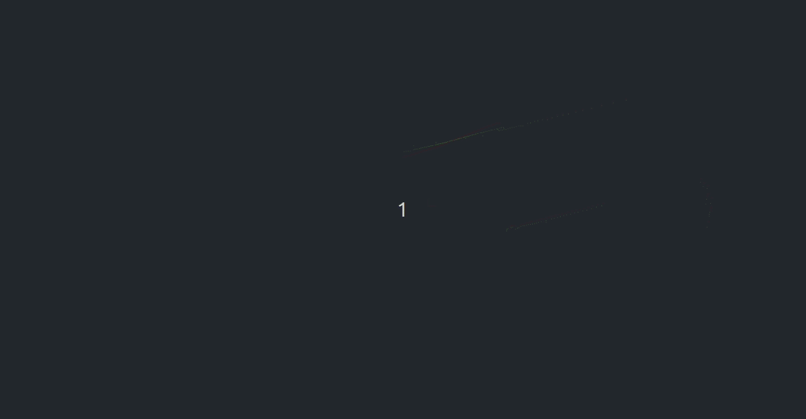

# Lidar-Distortion-Correction
　　Implementation of lidar motion distortion correction with wheel odometry in ROS. I use the interpolation of wheel odometry to calculate the robot pose corresponding to each point in the lidar scan, and transform it to the base pose frame.

## 1. Prerequisites
+ Ubuntu 64-bit 18.04
+ ROS Melodic

## 2.Build on ROS
+ Clone this repository to your catkin workspace and catkin_make.
```
  cd ${YOUR_WORKSPACE_PATH}/src
  git clone https://github.com/Mesywang/Lidar-Distortion-Correction
  cd ..
  catkin_make
```
## 3. Run the Demo

+ Launch the package.
```
  roslaunch laser_undistortion LaserUndistortion.launch  
  rosbag play --clock src/laser_undistortion/bag/laser.bag 
```

## 4. The result
　　Normally, You can see point clouds in two colors, the red represents the original point clouds with motion distortion, and the green represents the corrected point clouds, as displayed below:

<div align=center>
	
</div>